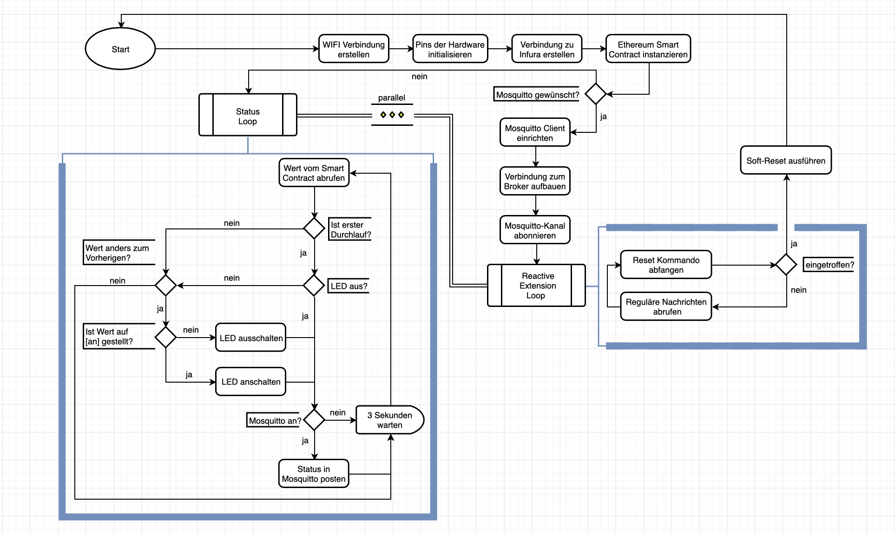

# blockchain-microcontroller

Python micontroller program built by Felix Hildebrandt as final thesis for IoT in 2020.

> **_NOTE:_** The commentary and files might appear in German.

## Description
The project is built to connect a Micro Controller to the Ropsten Testnetwork Blockchain of Ethereum. The Controller is tied to a LED and it's state can be locked or changed by sending a transaction to the Smart Contract of the Blockchain. The Micro Controller is scraping the current state by default and turns the LED on or off if needed. Those status updates can not only be received within the Micro Controller's  terminal, but also worldwide if the Mosquitto Protocol is enabled by the owner.

## Program Schedule

## Contributors
 - Solidity and Debugging: [Tim Käbisch](https://github.com/timkaebisch)
 - External Documentation: Konstantin Schwemlein

## Tools

- [Zerynth](https://www.zerynth.com/downloads/)
- [Mosquitto](https://mosquitto.org/)
- [Infura](https://infura.io/)
- [Wireshark](https://www.wireshark.org/)
## Hardware

- [ESP32-DevKitC](https://www.espressif.com/en/products/devkits/esp32-devkitc/overview)
- [Thingy-52](https://www.nordicsemi.com/Products/Development-hardware/Nordic-Thingy-52)
