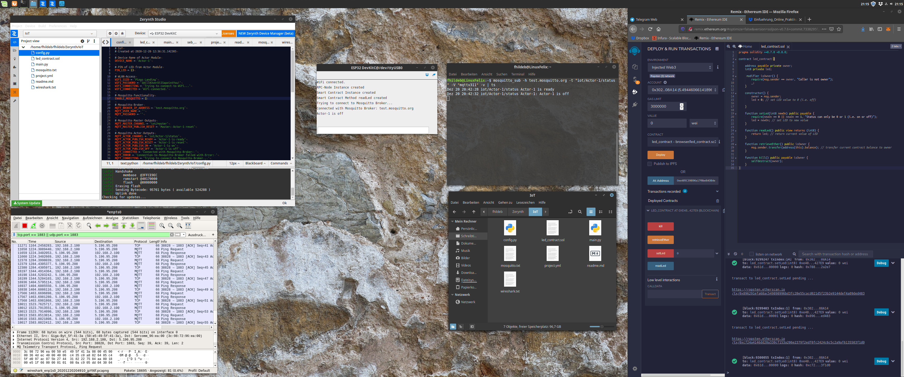

# blockchain-microcontroller

Python microcontroller program built by Felix Hildebrandt as final thesis for IoT in 2020.

> **_NOTE:_** The commentary and files might appear in German.

## Description

The project is built to connect a Micro Controller to the Ropsten test network Blockchain of Ethereum. The Controller is tied to a LED, and its state can be locked or changed by sending a transaction to the Smart Contract of the Blockchain. By default, the Micro Controller scrapes the current state and turns the LED on or off. Those status updates can be received within the Micro Controller's terminal and worldwide if the Mosquitto Protocol is enabled by the owner, featured within this repository as well.

The Mosquitto Data Channels can then be scraped for various other outcomes.

## Software Setup

## Program Schedule

## Contributors

- Solidity and Debugging: [Tim Käbisch](https://github.com/timkaebisch)
- External Documentation: Konstantin Schwemlein

## Tools

- [Zerynth](https://www.zerynth.com/downloads/)
- [Mosquitto](https://mosquitto.org/)
- [Infura](https://infura.io/)
- [Wireshark](https://www.wireshark.org/)

## Hardware

- [ESP32-DevKitC](https://www.espressif.com/en/products/devkits/esp32-devkitc/overview)
- [Thingy-52](https://www.nordicsemi.com/Products/Development-hardware/Nordic-Thingy-52)
